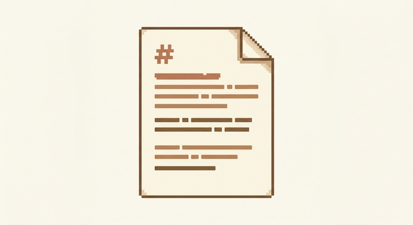
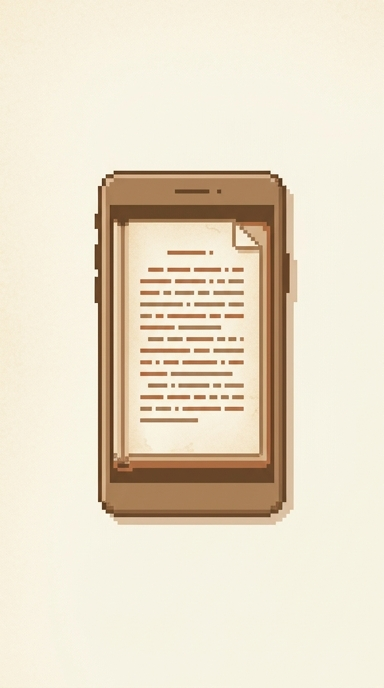

# md2ebook 사용 가이드

마크다운으로 써 둔 글 한 편이면 충분해요. 이 가이드는 **그 글을 어디서나 펼쳐 읽는 한 권의 책으로 바꾸는 방법**을 처음부터 끝까지 담았어요.

`[참고]` 차근차근 읽으셔도 좋고, 목차에서 끌리는 곳부터 펼쳐 보셔도 좋아요.

> 잘 쓴 글이 안 읽히는 건 대개 형식 탓이에요. 내용은 그대로 두고, 읽히는 모양만 바꿔 봅니다.

## 무엇을 위한 도구인가

md2ebook은 평범한 `.md` 파일을 **외부 의존성이 하나도 없는 오프라인 단일 HTML 책 리더(reader)**로 바꿔 줘요. CDN도, 웹폰트도, 자바스크립트 라이브러리도 끌어오지 않아요.

결과물은 파일 딱 하나라서, 메신저로 보내든 USB에 담든 받는 쪽은 더블클릭 한 번이면 바로 책을 펼쳐요. 네트워크가 끊긴 비행기에서도, 외부 접속이 막힌 폐쇄망에서도 똑같이 열려요.

글과 디자인이 분리돼 있다는 점이 핵심이에요. 다음 글을 낼 때도 마크다운 본문만 갈아 끼우면 같은 톤의 책이 다시 나와요. 한 번 마음에 든 모양을 계속 재사용하는 셈이죠.

`[팁]` 사내 공유 문서, 짧은 전자책, 발표 전 미리 읽히고 싶은 자료처럼 "한 사람이 차분히 끝까지 읽었으면" 하는 글에 잘 맞아요.

## 설치하기

`npx skills`를 쓰는 에이전트라면 어디서든 한 줄로 끝나요. Claude Code, Codex, Gemini CLI 모두 같은 명령을 써요.

```
npx skills add pollux-o4/md2ebook
```

설치한 다음에는 에이전트에게 `/md2ebook`이라고 부르고 변환할 `.md` 파일을 건네면 돼요. 나머지는 알아서 책 리더 HTML로 만들어 줘요.

### 이렇게 부르면 돼요

격식 차린 명령이 아니라, 평소 말하듯 자연어로 부르면 돼요. 폴더를 통째로 넘겨도 되고, 그 안의 특정 문서 하나만 짚어도 돼요.

> `/md2ebook 으로 my_skills 폴더 안의 .md 문서들 html로 바꿔줘`

> `/md2ebook my_skills 폴더의 A문서 변환해줘`

앞쪽처럼 부르면 폴더 안 마크다운을 한꺼번에, 뒤쪽처럼 부르면 짚어 준 문서 하나만 책으로 만들어 줘요.

`[참고]` 자세한 옵션과 구성은 [README](../README.html)에 정리돼 있어요. 소개가 궁금하시면 [소개 페이지](../intro.html)부터 둘러보셔도 좋아요.

## 글을 책으로 바꾸기

에이전트를 거치지 않고 직접 변환할 수도 있어요. 파이썬이 깔려 있다면 명령 한 줄이면 충분해요.

```
python build.py 내문서.md 내문서.html
```

### 파이썬이 없을 때

파이썬이 없어도 길은 있어요. `reader.html`을 복사한 뒤, 그 안의 마크다운 블록 내용만 내 글로 갈아 끼우면 돼요. 어느 쪽으로 만들든 결과물은 똑같아요.

### 시작 전 점검

막히지 않고 한 번에 끝내려면 아래만 미리 챙겨 두세요.

- [x] 변환할 `.md` 파일을 한 폴더에 두기
- [x] 제목 구조를 H1 한 개 + H2 여러 개로 잡아 두기
- [ ] 근거가 필요한 문장에 라벨 칩 달아 두기
- [ ] 표지 느낌을 줄 첫 문단 다듬기

`[중요]` 챕터는 H2를 기준으로 나뉘어요. 글을 여러 꼭지로 보여주고 싶다면 그 경계마다 H2를 두세요. 한 챕터가 화면 높이를 넘으면 리더가 알아서 다음 장으로 나눠 줘요.

## 책처럼 넘겨 읽기

리더를 열면 글이 화면 단위로 페이지네이션돼요. 마음에 드는 방식으로 장을 넘기면 되는데, 네 가지 넘김이 준비돼 있어요.

| 넘김 방식 | 느낌 |
|---|---|
| 3D 넘김 | 종이책을 넘기는 듯한 입체감 |
| 슬라이드 | 옆으로 밀려나는 깔끔한 전환 |
| 페이드 | 부드럽게 사라지고 떠오르는 전환 |
| 스크롤 | 페이지 구분 없이 위아래로 |

긴 글에서 길을 잃지 않도록 현재 위치를 짚어 주는 목차 드로어와 진행바가 늘 함께해요. 글에만 집중하고 싶을 땐 몰입모드로 군더더기를 걷어 내세요.

## 눈에 맞게 꾸미기

읽는 사람마다 편한 화면이 달라요. 그래서 리더 안에서 바로 바꿀 수 있게 해 두었어요.

### 설정 여는 법

화면 우상단의 `Aa` 버튼을 탭하면 설정 패널이 열려요. 테마, 글자 크기, 줄 간격, 서체를 모두 여기서 바로 바꿔요.

### 테마와 글자

테마는 paper, sepia, gray, black 네 가지예요. 밝은 곳에서는 paper나 sepia, 어두운 곳에서는 black이 눈에 편해요. 여기에 글자 크기와 줄 간격을 조절하고, 본문 서체를 고딕과 명조 사이에서 고를 수 있어요.

### 멈춘 자리 이어 읽기

읽던 위치와 이 설정들, 그리고 체크박스 상태까지 localStorage에 저장돼요. 창을 닫았다 다시 열어도 멈췄던 그 자리, 그 화면 그대로 이어 읽어요.

## 추가로 이런 것도 — 색 라벨 칩

여기서부터는 있으면 좋은 부가기능이에요. 먼저 색 라벨 칩부터 볼게요.

백틱으로 감싼 대괄호 단어가 색칩이 돼요. 예를 들어 이렇게 적으면

```
`[중요]`   `[디자인]`   `[리뷰]`
```

리더에서는 `[중요]` `[디자인]` `[리뷰]` 처럼 또렷한 색칩으로 떠요. 대괄호만 쓰면 안 되고, 그 바깥을 백틱으로 한 번 더 감싸야 한다는 것만 기억하면 돼요.

아무 단어나 칩이 되고, 같은 단어는 어느 문서에서나 같은 색이라 여러 글에 걸쳐 일관되게 보여요. 색이 마음에 안 들면 리더 안에서 직접 바꿀 수도 있어요. `[중요]` `[TODO]` `[참고]` 처럼 자주 쓰는 말은 색이 미리 정해져 있고요.

## 그 밖의 읽기 편의 기능

본문 안의 요소도 리더에서 조금씩 더 편하게 다룰 수 있어요.

### 코드블록 복사 버튼

코드블록에는 복사 버튼이 붙어요. 길게 드래그할 필요 없이, 오른쪽 위 버튼을 한 번 눌러 통째로 복사해요. 아래 블록에서 바로 해 보세요.

```
python build.py guide.md guide.html
```

### 이미지 탭 확대

이미지는 탭하면 크게 확대돼요. 작게 들어간 그림도 자세히 들여다볼 수 있어요. 가로로 길든 세로로 길든 본문 폭에 맞춰 들어오고, 세로로 긴 그림은 화면 높이를 넘지 않게 담겨요. 아래 그림들을 한 번 탭해 보세요.






### 체크박스 토글

체크박스가 있는 목록은 눌러서 토글할 수 있고, 그 상태가 그대로 저장돼요. 아래 항목을 직접 체크해 보세요.

- [x] 변환할 글 고르기
- [ ] 넘김과 테마 맞추기
- [ ] 완성한 책 공유하기

## 이제 펼쳐 볼 차례

여기까지 읽으셨다면 흐름은 다 잡힌 거예요. 설치하고, 글 한 편을 변환하고, 마음에 드는 넘김과 테마로 맞춘 다음, 책을 그대로 누군가에게 건네면 돼요.

처음 한 권은 짧은 글로 가볍게 만들어 보시길 권해요. 손에 익으면 그다음부터는 본문만 바꿔 끼우는 일이라, 두 번째 책은 첫 책보다 훨씬 빨리 나와요. 마크다운으로 쓴 글이 그대로 한 권의 책이 되는 경험, 직접 한 번 해 보세요.
